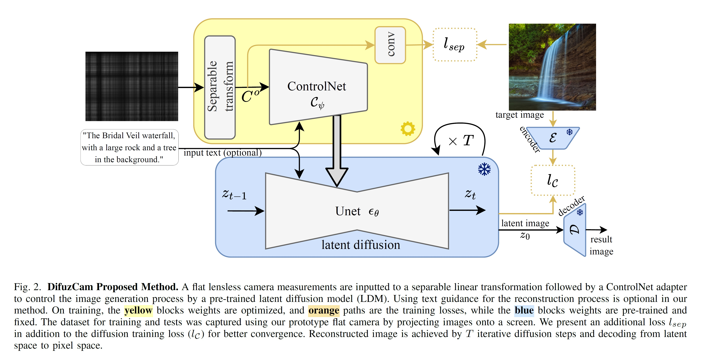
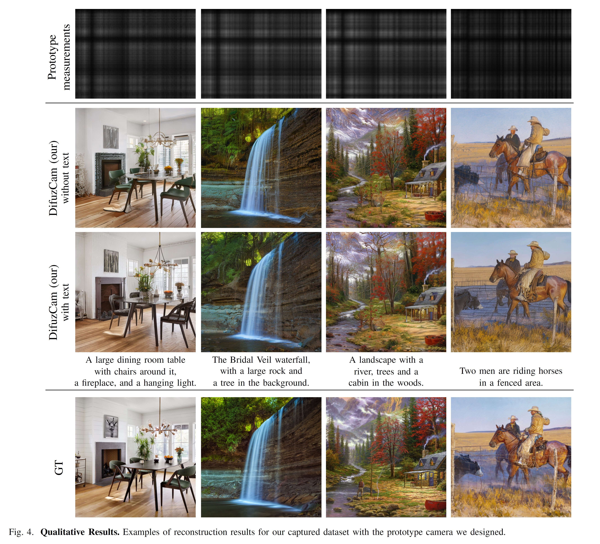
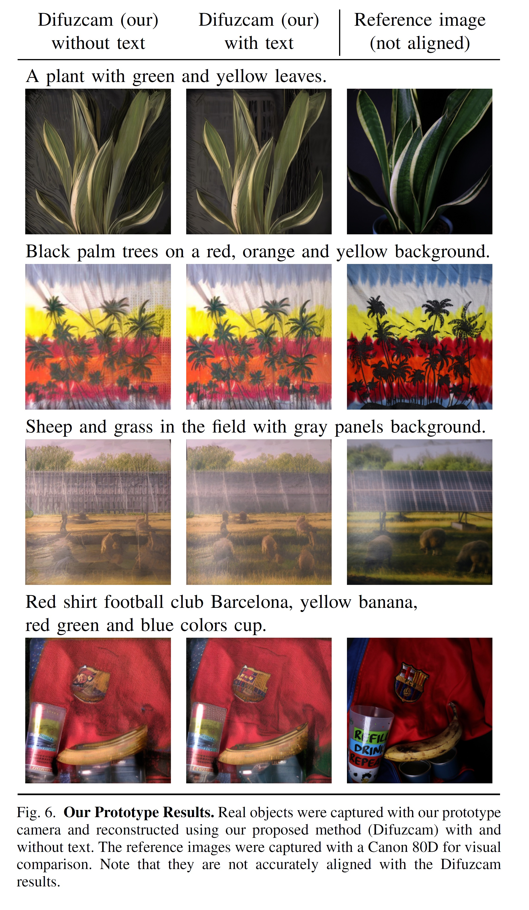

# DifuzCam: Replacing Camera Lens with a Mask and a Diffusion Model for Generative AI Based Flat Camera Design


### [**Erez Yosef**](https://erezyosef.github.io/), [**Raja Giryes**](https://www.giryes.sites.tau.ac.il/)
#### Tel Aviv University, Israel

This work was published in **Scientific Reports**, Volume 15, Nature Publishing Group. [paper](https://www.nature.com/articles/s41598-025-27127-1)  
📅 Published: 03 December 2025

[](https://doi.org/10.1038/s41598-025-27127-1)
[](https://doi.org/10.1038/s41598-025-27127-1)
[](https://arxiv.org/abs/2408.07541)


## 📌 Abstract

Recent advances in lensless, flat camera designs hold the promise of significantly reducing size and weight by replacing bulky lenses with thin optical elements that modulate incoming light. However, recovering high-quality images from the raw sensor measurements of such systems remains challenging. We address this limitation by introducing a novel reconstruction framework that leverages a pre-trained diffusion model, guided by a control network and a learnable separable transformation. This approach delivers high-fidelity images, achieving state-of-the-art performance in both objective and perceptual metrics. Our method achieves 20.43 PSNR, 0.612 SSIM, and 0.237 LPIPS on the FlatNet dataset, representing improvements of 9.6%, 18.1%, and 26.4% respectively over the previous state-of-the-art FlatNet method. Additionally, the text-conditioned nature of the diffusion model enables optional enhancement through scene descriptions, particularly valuable for compact imaging systems where user input can help resolve reconstruction ambiguities. We demonstrate the effectiveness of our method on a prototype flat camera, paving the way for advanced lensless imaging solutions and offering a robust framework for improved reconstructions that is relevant to a broad range of computational imaging systems.

<p align="center">
  
</p>

### Project Diagram Overview

<p align="center">
  
</p>

## 🧪 Results

### Simulation

<p align="center">
  
</p>

### Real-World

<p align="center">
  
</p>


---

## 🛠️ Installation

### Setup Environment

1. **Clone the repository:**
```bash
git clone https://github.com/ErezYosef/Difuzcam-AI.git
cd Difuzcam-AI
```

2. **Create a virtual environment (recommended):**
```bash
python -m venv difuzcam_env
source difuzcam_env/bin/activate
```

3. **Install dependencies:**
```bash
pip install -r Difuzcam_requirements.txt
```

---


### Datasets

The DifuzCam dataset is available on HuggingFace:

Dataset name: `ErezYosef/Difuzcam_dataset`

Available at: [https://huggingface.co/datasets/ErezYosef/Difuzcam_dataset](https://huggingface.co/datasets/ErezYosef/Difuzcam_dataset) 

The dataset will be automatically downloaded when running training/validation

The training dataset contain 54170 image samples and the validation dateset contain 500 sampes.

Each sample contains:
- Raw sensor measurements from the flat camera
- Ground truth RGB images
- Text captions for conditional generation

### Pre-trained Models

Download the pre-trained ControlNet weights:

**Option 1: From HuggingFace**

Use the model from [`ErezYosef/Difuzcam_model` 🤗](https://huggingface.co/ErezYosef/Difuzcam_model)

```bash
# Model available at:  https://huggingface.co/ErezYosef/Difuzcam_model
# load controlnet:
unet = UNet2DConditionModel.from_pretrained('stabilityai/stable-diffusion-2-1-base',subfolder="unet",revision=None, variant=None)
controlnet = FlatControlNetModel_Efull.from_pretrained('ErezYosef/controlnet', low_cpu_mem_usage=False, unet=unet)

```

**Option 2: From GitHub Releases**
```bash
# Download from: https://github.com/ErezYosef/Difuzcam-AI/releases
# Extract to a directory and update the file paths (controlnet_model_name_or_path)
```

The model includes:
- ControlNet weights trained on flat camera data
- Compatible with Stable Diffusion 2.1 base model
- Supports both simulated and real-world image reconstruction

---

## 🎯 Inference

### Simulated Dataset Validation

Run inference on the validation split of the simulated DifuzCam dataset:

```bash
accelerate launch myval_flat_controlnet.py \
  --config_file configs_stable/val_Eflat_config.yaml \
  --controlnet_model_name_or_path PATH_TO_CONTROLNET_WEIGHTS/checkpoint-500000/controlnet \
  -d validation_run
```

**Configuration:**
- Edit `configs_stable/val_Eflat_config.yaml` to set output paths
- The `main_path` parameter controls where results are saved

### Real-World Camera Images

Process real-world acquisitions from the prototype flat camera:

```bash
accelerate launch myval_flat_controlnet.py \
  --config_file configs_stable/val_real_flat_config.yaml \
  --controlnet_model_name_or_path PATH_TO_CONTROLNET_WEIGHTS/checkpoint-500000/controlnet \
  --dataset_config_name fullsize_captions_tag0704a \
  -d real_world_sample
```

---

## 🚀 Training

### Basic Training

To train the ControlNet from scratch on the training dataset:

```bash
accelerate launch mytrain_Eflat_controlnet.py \
  --config_file configs_stable/train_Eflat_config.yaml \
  -d my_training_run
```


## 📜 Citation

If you find this work useful in your research, please cite:

```bibtex
@article{yosef2025difuzcam,
  title={DifuzCam: Replacing Camera Lens with a Mask and a Diffusion Model for Generative AI Based Flat Camera Design},
  author={Yosef, Erez and Giryes, Raja},
  journal={Scientific Reports},
  volume={15},
  number={1},
  pages={43059},
  year={2025},
  publisher={Nature Publishing Group UK London}
}
```


## 📬 Contact

If you have any questions or inquiries, feel free to reach out:
### **Erez Yosef** - [Erez.Yo@gmail.com](mailto:erez.yo@gmail.com)

